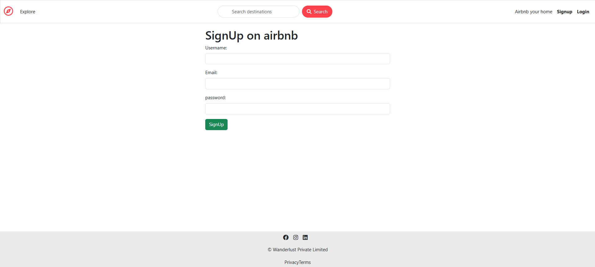
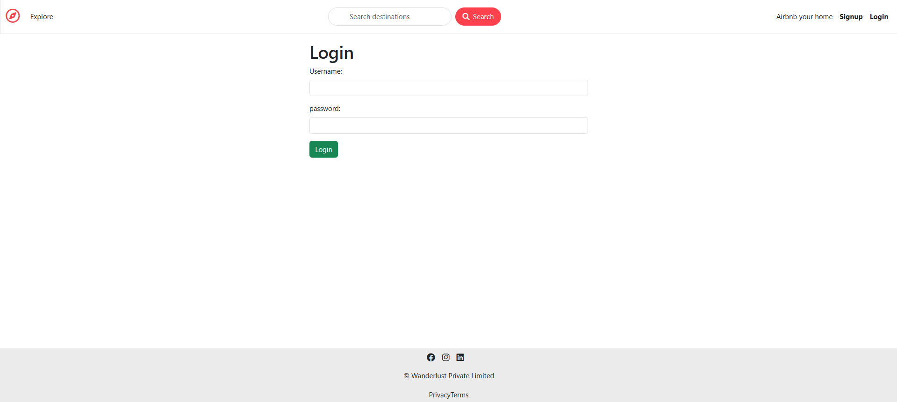

#  Airbnb Clone (MERN Stack)

A full-stack Airbnb clone built using the **MERN stack** (MongoDB, Express, React, Node.js). Users can explore, list, and book stays just like the real Airbnb platform.

---

## 🚀 Tech Stack

- **Frontend:** React, Tailwind CSS
- **Backend:** Node.js, Express.js
- **Database:** MongoDB

---

## ✨ Features

- ✅ User Registration and Login
- 🏡 Add New Listings (with images and description)
- 🔍 Browse Available Stays
- 📅 Booking System
- 🌐 Fully responsive design

---

## 🖼️ Preview





---

## 🛠️ Installation

```bash
# Clone the repository
git clone https://github.com/your-username/airbnb-clone.git
cd airbnb-clone
#to run
node app.js

